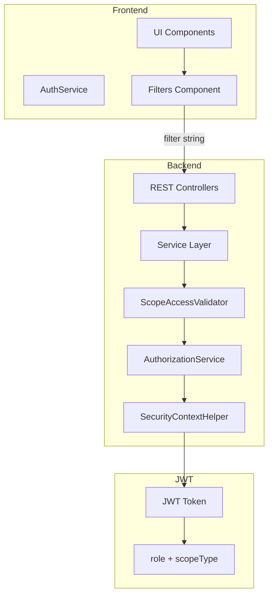

# Scope Validation and Access Control Improvements

## Current State Analysis

The current implementation has two main issues:

1. **Backend overrides requests** using `buildScopeAndClubFilter` instead of validating them
2. **Inconsistent scope validation** across different services

## Architecture Overview



## Backend Changes

### 1. Create Centralized Scope Validation Service

Create a new service `ScopeAccessValidator` in `[backend/src/main/java/com/bfg/platform/common/security/](backend/src/main/java/com/bfg/platform/common/security/)` that handles all scope validation logic:

```java
public interface ScopeAccessValidator {
    // Validate filter scope matches user permissions
    void validateScopeFilter(String filter, ScopeType userScope, SystemRole userRole);

    // Validate club access for EXTERNAL/NATIONAL scopes
    void validateClubAccess(UUID requestedClubId, ScopeType userScope, SystemRole userRole);

    // Get allowed scopes for user role
    List<ScopeType> getAllowedScopesForRole(SystemRole role, ScopeType userScope);

    // Validate single resource access
    void validateResourceAccess(ScopeType resourceScope, UUID resourceClubId);
}
```

**Rules to implement:**

- **APP_ADMIN / FEDERATION_ADMIN**: Can filter by ALL scopes (INTERNAL, EXTERNAL, NATIONAL)
- **CLUB_ADMIN (INTERNAL)**: Can filter only INTERNAL scope
- **CLUB_ADMIN (EXTERNAL/NATIONAL)**:
  - For accreditations: Can filter only their own scope AND their own club
  - For other objects: Can filter only their own scope
- **COACH**: Inherits scope from assigned club

### 2. Remove Filter Override Pattern

Modify services to **validate** instead of **override**:

`**[AccreditationServiceImpl.java](backend/src/main/java/com/bfg/platform/athlete/service/AccreditationServiceImpl.java)`

- Remove `buildScopeAndClubFilter` method
- Add validation that checks:
  - Requested scope matches user's allowed scopes
  - For EXTERNAL/NATIONAL: requested clubId matches user's club (if specified)
- Return 403 if validation fails

`**[ClubServiceImpl.java](backend/src/main/java/com/bfg/platform/club/service/ClubServiceImpl.java)`

- Remove `buildScopeFilter` method
- Add scope validation using `ScopeAccessValidator`

`**[AthleteServiceImpl.java](backend/src/main/java/com/bfg/platform/athlete/service/AthleteServiceImpl.java)`

- Remove filter override logic
- Add validation for scope and club access

`**[UserServiceImpl.java](backend/src/main/java/com/bfg/platform/user/service/UserServiceImpl.java)`

- Already has `validateScopeTypeInFilter` - extend it to use `ScopeAccessValidator`

### 3. Update JWT Token Claims

Ensure scope is always included in JWT (`[AuthServiceImpl.java](backend/src/main/java/com/bfg/platform/auth/service/AuthServiceImpl.java)`):

- Already includes `scopeType` claim - verify it's always present
- Add `clubId` claim for CLUB_ADMIN and COACH roles (for frontend convenience)

### 4. Update User Creation Validation

In `[UserServiceImpl.java](backend/src/main/java/com/bfg/platform/user/service/UserServiceImpl.java)`, update `validateCreatePermissions`:

```java
private void validateCreatePermissions(UserCreateRequest request) {
    SystemRole currentRole = securityContextHelper.getUserRole();
    ScopeType currentScope = securityContextHelper.getScopeType();
    SystemRole targetRole = request.getRole();
    ScopeType targetScope = request.getScopeType();

    // Validate scope inheritance rules:
    // - CLUB_ADMIN can only create users with same scope
    // - FEDERATION_ADMIN/APP_ADMIN can create CLUB_ADMIN with any scope
    // - Default scope is INTERNAL if not specified
    // - Only CLUB_ADMIN can have non-INTERNAL scope
}
```

### 5. OpenAPI Schema Updates

Update `[openapi.yaml](backend/src/main/resources/static/openapi/openapi.yaml)` and related schemas:

- No changes needed - ScopeType is already defined
- Ensure all endpoints document scope validation errors (403)

## Frontend Changes

### 1. Add Scope Visibility Control

Create a utility service or extend `[AuthService](frontend/src/app/core/services/auth.service.ts)`:

```typescript
// Add to AuthService
canViewScopeFeatures(): boolean {
  const role = this.getCurrentUserRoles()[0];
  return role === 'APP_ADMIN' || role === 'FEDERATION_ADMIN';
}

getAllowedScopes(): ScopeType[] {
  const role = this.getCurrentUserRoles()[0];
  if (role === 'APP_ADMIN' || role === 'FEDERATION_ADMIN') {
    return [ScopeType.Internal, ScopeType.External, ScopeType.National];
  }
  const userScope = this.getScopeType();
  return userScope ? [userScope as ScopeType] : [ScopeType.Internal];
}

canViewClubFilter(): boolean {
  const role = this.getCurrentUserRoles()[0];
  const scope = this.getScopeType();
  // EXTERNAL/NATIONAL CLUB_ADMIN cannot see club filter (always their club)
  if (role === 'CLUB_ADMIN' && scope !== 'INTERNAL') {
    return false;
  }
  return true;
}
```

### 2. Update Filter Components

For each feature (Accreditations, Clubs, Users, Athletes):

**Scope Filter Visibility:**

- Only show scope filter if `canViewScopeFeatures()` returns true
- Already implemented via `showScopeFeatures` - verify consistency

**Club Filter Visibility (Accreditations):**

- Hide club filter for EXTERNAL/NATIONAL CLUB_ADMIN
- Update `[accreditations-filters.component.ts](frontend/src/app/features/accreditations/components/accreditations-filters/accreditations-filters.component.ts)`

### 3. Update Table Components

**Scope Column Visibility:**

- Only show scope column if `canViewScopeFeatures()` returns true
- Already implemented via `showScopeFeatures` - verify consistency

Files to verify:

- `[accreditations-table.component.ts](frontend/src/app/features/accreditations/components/accreditations-table/accreditations-table.component.ts)`
- `[clubs-table.component.ts](frontend/src/app/features/clubs/components/clubs-table/clubs-table.component.ts)`
- `[users-table.component.ts](frontend/src/app/features/users/components/users-table/users-table.component.ts)`

### 4. Update Detail Dialogs

**Scope Field Visibility:**

- Only show scope in details if `showScopeInDetails` (APP_ADMIN/FEDERATION_ADMIN)
- Already implemented - verify consistency

### 5. Update Add User Dialog

In `[add-user-dialog.component.ts](frontend/src/app/features/users/components/add-user-dialog/add-user-dialog.component.ts)`:

- Only show scope field when creating CLUB_ADMIN
- Show scope field only if current user is APP_ADMIN or FEDERATION_ADMIN
- Inherit scope from current user for CLUB_ADMIN creating users

```typescript
get showScopeField(): boolean {
  return (
    this.formData.role === 'CLUB_ADMIN' &&
    (this.userRole === 'APP_ADMIN' || this.userRole === 'FEDERATION_ADMIN')
  );
}

// When CLUB_ADMIN creates a user, scope is inherited (not visible)
// When APP_ADMIN/FEDERATION_ADMIN creates CLUB_ADMIN, scope can be selected
```

### 6. Default Filter Behavior

For users without scope visibility:

- Automatically apply their scope to all API requests
- Update main component files to set default scope filter:

```typescript
// In accreditations.component.ts, clubs.component.ts, etc.
private getDefaultFilters(): AccreditationFilters {
  const filters: AccreditationFilters = { /* ... */ };

  if (!this.showScopeFeatures) {
    // Auto-filter by user's scope
    filters.scopeTypes = [this.authService.getScopeType() || 'INTERNAL'];
  }

  return filters;
}
```

## Validation Error Handling

### Backend

- Return `403 Forbidden` with clear error message when scope validation fails
- Error format: `"Not authorized to access {resourceType} with scope '{requestedScope}'. Your scope is '{userScope}'."`

### Frontend

- Handle 403 errors gracefully in API calls
- Display user-friendly error messages
- Do not expose internal scope values in error messages to end users

## Summary of Key Files to Modify

**Backend:**

1. NEW: `backend/src/main/java/com/bfg/platform/common/security/ScopeAccessValidator.java`
2. NEW: `backend/src/main/java/com/bfg/platform/common/security/ScopeAccessValidatorImpl.java`
3. `backend/src/main/java/com/bfg/platform/athlete/service/AccreditationServiceImpl.java`
4. `backend/src/main/java/com/bfg/platform/athlete/service/AthleteServiceImpl.java`
5. `backend/src/main/java/com/bfg/platform/club/service/ClubServiceImpl.java`
6. `backend/src/main/java/com/bfg/platform/user/service/UserServiceImpl.java`
7. `backend/src/main/java/com/bfg/platform/auth/service/AuthServiceImpl.java` (add clubId to JWT)

**Frontend:**

1. `frontend/src/app/core/services/auth.service.ts` (add helper methods)
2. `frontend/src/app/features/accreditations/accreditations.component.ts`
3. `frontend/src/app/features/accreditations/components/accreditations-filters/accreditations-filters.component.ts`
4. `frontend/src/app/features/clubs/clubs.component.ts`
5. `frontend/src/app/features/users/users.component.ts`
6. `frontend/src/app/features/users/components/add-user-dialog/add-user-dialog.component.ts`
